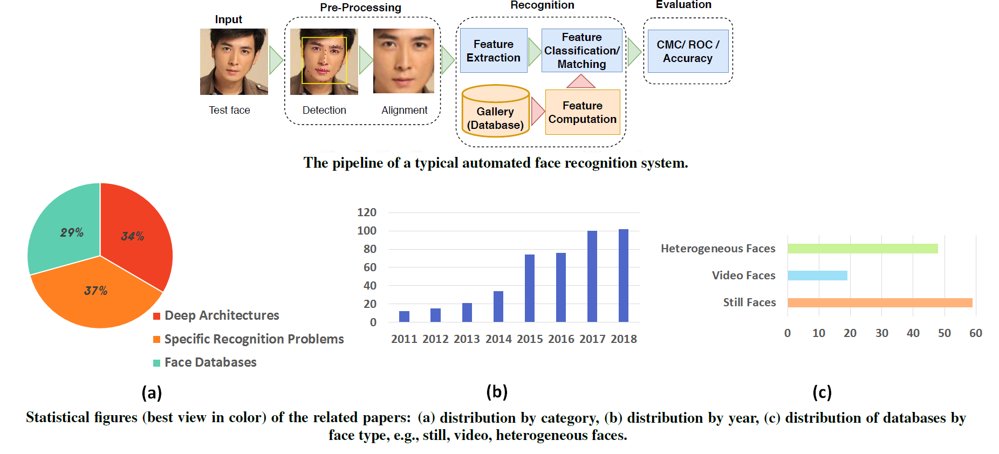
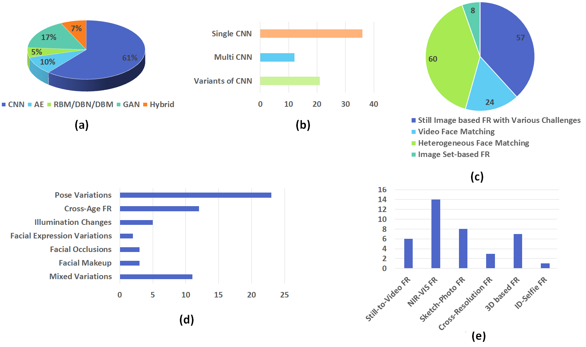
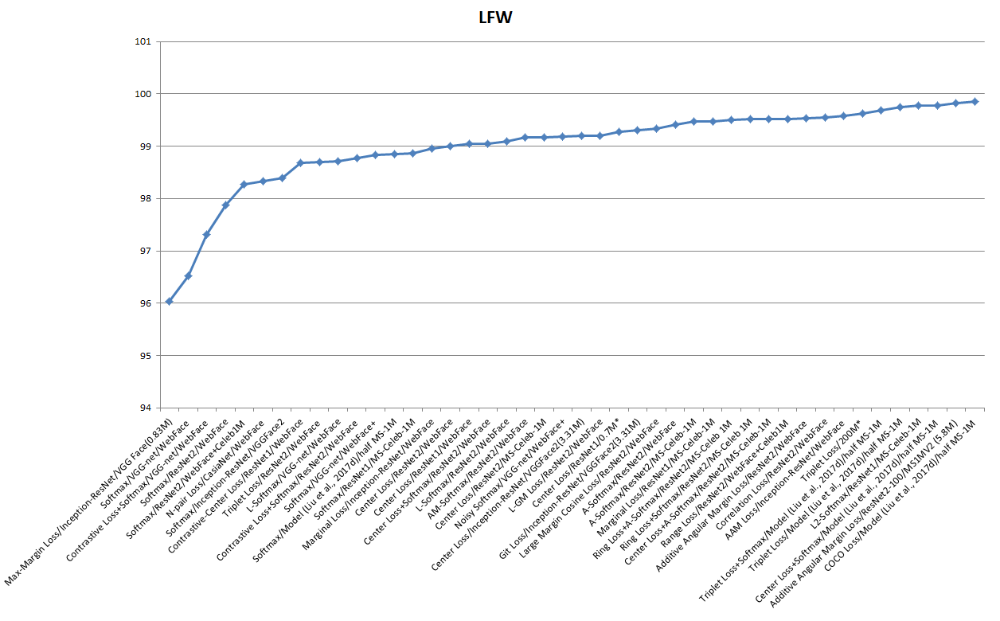
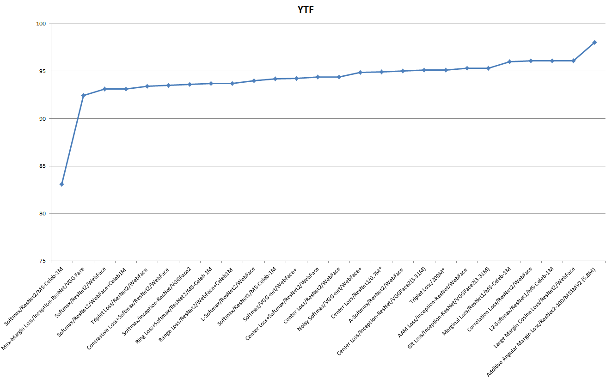
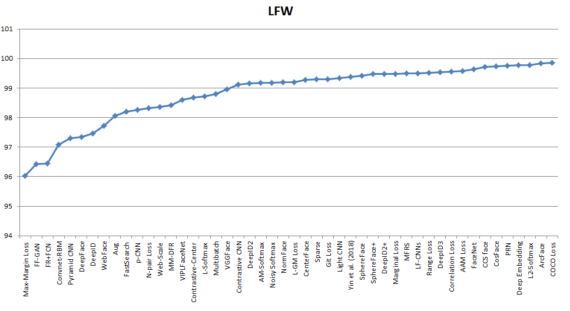
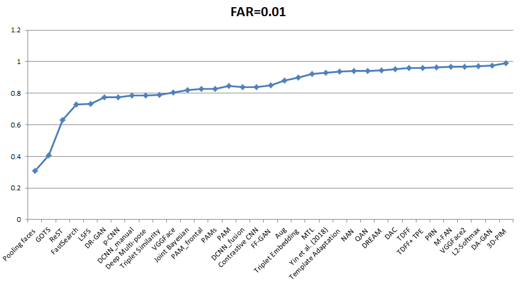
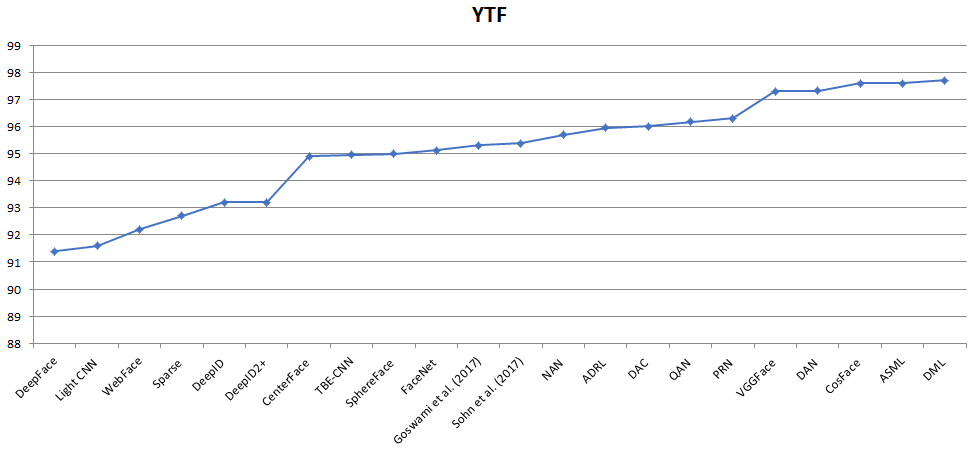

# A survey on deep learning based face recognition
Some materials for paper 'A survey on deep learning based face recognition'

This repository contains main papers/slides for the survey paper.
• This survey presents a comprehensive overview of about 330 face recognition works using deep learning within the recent years
• It shows that:
✔ DL has been fully applied to FR and plays important roles;
✔ Many specific issues or challenges have been addressed in FR by DL, e.g., pose, illumination, expression, 3D, heterogenous
matching;
✔ Various face datasets have been collected in recent years, including still images, videos, and heterogeneous data.

### Link: 

[[PDF]](https://www.sciencedirect.com/science/article/abs/pii/S1077314219301183)
[[Paper Repository]](https://www.sciencedirect.com/science/article/abs/pii/S1077314219301183)

# paper distribution

# performance comparison of different loss function on LFW, YTF

# performance comparison of existing DL based methods on image database LFW

# performance comparison of existing DL based methods on image database IJB-A

# performance comparison of existing DL based methods on video database YouTube Faces (YTF)

