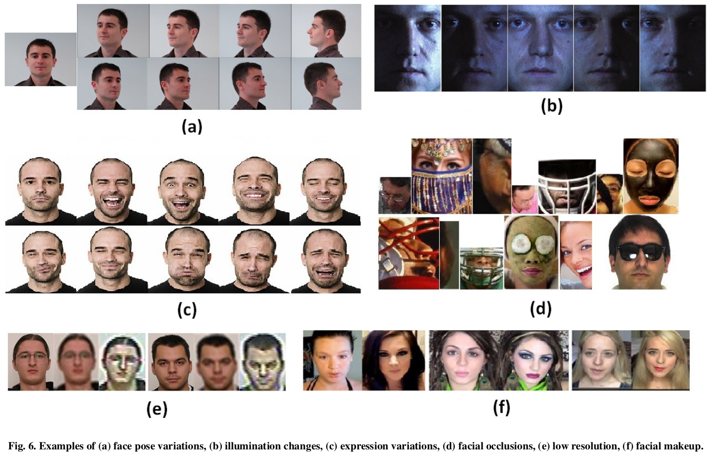

# A survey on deep learning based face recognition
Materials for paper 'A survey on deep learning based face recognition, G Guo, N Zhang - Computer vision and image understanding, 2019.'

# Link: 
[[PDF]](https://www.sciencedirect.com/science/article/abs/pii/S1077314219301183)

# Content
This repository contains main papers/slides for the survey paper.
* This survey presents a comprehensive overview of about 330 face recognition works using deep learning within the recent years
* It shows that:

    DL has been fully applied to FR and plays important roles;
    
    Many specific issues or challenges have been addressed in FR by DL, e.g., pose, illumination, expression, 3D, heterogenous matching;
    
    Various face datasets have been collected in recent years, including still images, videos, and heterogeneous data.

# Abstract
* Deep learning, in particular the deep convolutional neural networks, has received increasing interests in face recognition recently, and a number of deep learning methods have been proposed.
* This paper summarizes about 330 contributions in this area.
* It reviews major deep learning concepts pertinent to face image analysis and face recognition, and provides a concise overview of studies on specific face recognition problems, such as handling variations in pose, age, illumination, expression, and heterogeneous face matching.
* A summary of databases used for deep face recognition is given as well.
* Finally, some open challenges and directions are discussed for future research.

# Face Recognition
* Face is the most common characteristic used by humans for recognition.
* Face recognition (FR) is a classical problem and is still very active in computer vision and image understanding.
* Fig. shows the pipeline of a typical automatic face recognition system.
 
    A face image is fed into the system, and face detection and face alignment are processed. And then a feature extractor is used to extract features. Finally, the system compares the extracted features with the gallery faces to do face matching.

  In face matching, there are two different tasks: face verification (FV) and face identification (FI).

  FV is to determine whether a given pair of face images or videos belongs to the same subject.
  
  FI is a one-to-many matching, recognizing the person from a set of gallery face images or videos of different subjects.
 
 

### FR Algorithms Comparison

# Performance comparison of different loss function on LFW, YTF

# Performance comparison of existing DL based methods on image database LFW

# performance comparison of existing DL based methods on image database IJB-A

# performance comparison of existing DL based methods on video database YouTube Faces (YTF)

### Specific Problems

